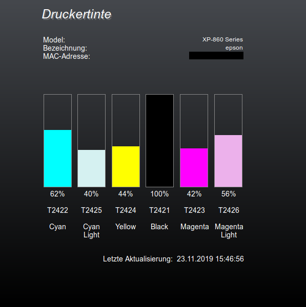

# ioBroker.epson_xp860

**Tests:**: 

# IoBroker Adapter for Epson Expression Photo XP860
(German version see below)

## Description
This is more an adapter-like helper script than a real adapter. Because the printer does not support the snmp-standard-printer-MIB, the ink status of the Epson XP860 is read from the printer's Web site. (Only if the printer is set to German)

It is an adaptation of the iobroker.epson_stylus_px830 adapter developed by Pix--.
-> https://github.com/Pix---/ioBroker.epson_stylus_px830

Now it reads the ink levels of an **Epson Expression Photo XP-860** and in addition, it was converted into a **scheduled adapter**

## Configuration
### IP / Port
IP adress of Epson Printer within local network. The adapter will stop if no IP is entered. The port number is optional and will only be considered if an ip adress is entered.

## Schedule
The reading interval of the ink level can be set via the scheduling on the 'Instances' page. Default is every full hour.

## Datapoints

ink_black  
ink_cyan  
ink_cyanlight  
ink_magenta  
ink_magentalight  
ink_yellow  
printerInfo.connection (type of connection, WLAN,LAN)  
printerInfo.ip  
printerInfo.mac  
printerInfo.model  
printerInfo.name  
printerInfo.requestResponded (True if printer responded on last request)  

## VIS
### Widget
Example set of widgets for VIS (developed by Pix--)
https://raw.githubusercontent.com/bowao/ioBroker.epson_xp860/master/widgets/ink_widget

## Beschreibung
Dies ist eher ein Adapter-ähnliches Hilfsskript als ein echter Adapter. Da der Drucker die snmp-standard-printer-MIB nicht unterstützt, wird der Tintenstatus des Epson XP860 von der Website des Druckers gelesen. (Nur wenn der Drucker auf Deutsch eingestellt ist)

Dies ist eine Adaption des Adapters iobroker.epson_stylus_px830 entwickelt von Pix--
-> https://github.com/Pix---/ioBroker.epson_stylus_px830

Nun liest der Adapter den Füllstand der Tintenpatronen eines **Epson Expression Photo XP-860** und zusätzlich wurde er zu einem **Zeitgesteuerten-Adapter** umgebaut.

## Einstellungen
### IP / Port
Die IP Adresse des Druckers im lokalen Netzwerk. Ohne Eingabe gibt es keine Abfrage. Die Portnummer ist optional und wird nur bei Eingabe einer IP-Adresse berücksichtigt.

### Schedule
Der Abfrageintervall kann auf der Seite 'Instanzen' über die Spalte 'Zeitplanung' angepasst werden. Standardeinstellung: zu jeder vollen Stunde.

##  Konfiguration

## Datenpunkte

ink_black  
ink_cyan  
ink_cyanlight  
ink_magenta  
ink_magentalight  
ink_yellow  
printerInfo.connection (Verbindungsart WLAN,LAN)  
printerInfo.ip  
printerInfo.mac  
printerInfo.model  
printerInfo.name  
printerInfo.requestResponded (Wahr, wenn der Drucker auf die letzte Anfrage geantwortet hat)  

## VIS
### Widget
Beispiel widgets für VIS (entwickelt von Pix--)
https://raw.githubusercontent.com/bowao/ioBroker.epson_xp860/master/widgets/ink_widget

## Changelog
### 2.0.0
- Update dependencies
- Replace deprecated npm packet request with standard library module http
- Fixed wrong links to data points printer model, name and mac in widget
- Fixed invalid obj.common.type in datapoint requestResponded
- BREAKING CHANGE: Drop node 8 support
- BREAKING CHANGE: js-controller v2.4.0 or above required
- BREAKING CHANGE: Remove datapoint responseTime

### 1.0.0
- stable release

## License

The MIT License (MIT)

Copyright (c) 2020 bowao <cryolab@web.de>

Permission is hereby granted, free of charge, to any person obtaining a copy
of this software and associated documentation files (the "Software"), to deal
in the Software without restriction, including without limitation the rights
to use, copy, modify, merge, publish, distribute, sublicense, and/or sell
copies of the Software, and to permit persons to whom the Software is
furnished to do so, subject to the following conditions:

The above copyright notice and this permission notice shall be included in all
copies or substantial portions of the Software.

THE SOFTWARE IS PROVIDED "AS IS", WITHOUT WARRANTY OF ANY KIND, EXPRESS OR
IMPLIED, INCLUDING BUT NOT LIMITED TO THE WARRANTIES OF MERCHANTABILITY,
FITNESS FOR A PARTICULAR PURPOSE AND NONINFRINGEMENT. IN NO EVENT SHALL THE
AUTHORS OR COPYRIGHT HOLDERS BE LIABLE FOR ANY CLAIM, DAMAGES OR OTHER
LIABILITY, WHETHER IN AN ACTION OF CONTRACT, TORT OR OTHERWISE, ARISING FROM,
OUT OF OR IN CONNECTION WITH THE SOFTWARE OR THE USE OR OTHER DEALINGS IN THE
SOFTWARE.

---

